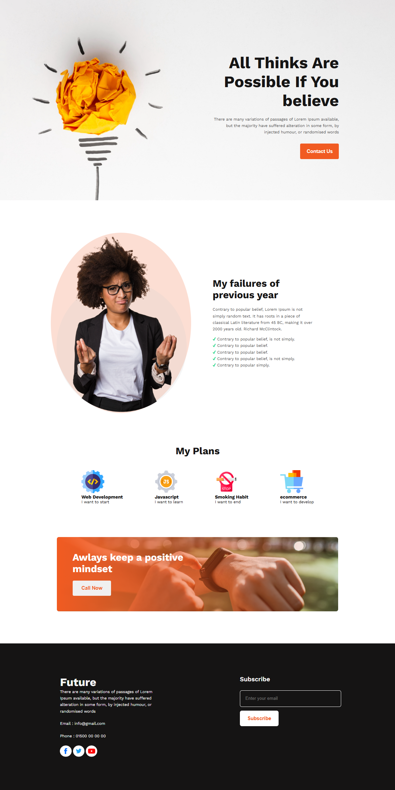

# My First Website

A simple personal landing page built as one of my first frontend projects using **HTML and CSS**.

## What I Practiced

* Built a complete webpage structure using semantic HTML sections.
* Created a hero/banner section with a call-to-action button.
* Designed content sections for previous-year reflections and future plans.
* Created a skills/plans section using reusable HTML structures.
* Added a call-to-action section and footer with contact information.
* Practiced organizing images, icons, and CSS files into separate folders.
* Used custom Google Fonts and basic CSS styling to improve the visual presentation.

## Technologies Used

* HTML5
* CSS3
* Google Fonts

## Project Structure

```text
My-First-Website/
├── images/
│   └── banner/
│   └── icons/
├── styles/
│   └── styles.css
├── index.html
└── README.md
```

## Live Website

[View Live Website](https://fahmidaaktershimu.github.io/My-First-Website)


## Desktop View

